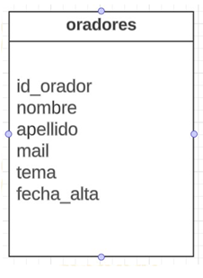

# TP integrador BD
Trabajo integrador de Base de Datos para el curso de Codo a Codo - Full-Stack JAVA.
Comisión 23544
 Trabajo Práctico Integrador Base de Datos

Se deberá crear una base de datos llamada “integrador_cac” y crear la siguiente tabla llamada “oradores”:

* Definir los tipos de datos correspondientes
* Definir la clave primaria correspondiente
* Definir las restricciones correspondientes
* Insertar 10 registros
* Hacer un backup de la base de datos
***
La entrega deberá ser subiendo el Backup de la base de datos, una captura de la estructura de la tabla y una captura de los registros insertados a un repositorio de Github y luego compartir el enlace.
